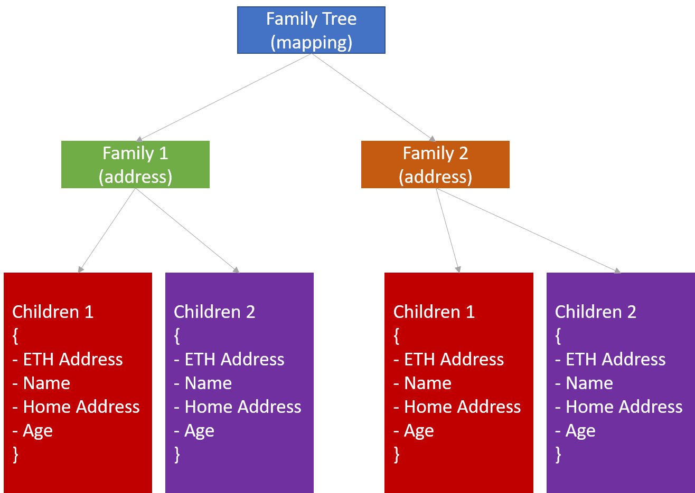

# FamilyTree
## About
Create a family tree with each family having many children with attribute like eth_address, name, home_address, age.



## Implementation
Ethereum + Solidity + Hardhat + Typechain

## Setup
### 1. Environment variables
* Create a `.env` file with its values:
```
DEPLOYER_PRIVATE_KEY=<private_key_without_0x>
INFURA_API_KEY=<SECRET_KEY>
REPORT_GAS=<true_or_false>
```

### 2. Install the dependencies
* `$ npm install` (install all the packages listed inside `package.json`)

## Usage

### Pre Requisites

Before running any command, make sure to install dependencies:

```sh
$ npm install
```

### Compile

Compile the smart contracts with Hardhat:

```sh
$ npx hardhat compile
```

### Test

Run the Mocha tests:

```sh
$ npx hardhat test
```

### Deploy contract to netowrk (requires Mnemonic/deployer_private_key and Infura API key)

```
npx hardhat run --network rinkeby ./deployment/deploy.ts
```

### Validate a contract with etherscan (requires API ke)

```
npx hardhat verify --network <network> <DEPLOYED_CONTRACT_ADDRESS> "Constructor argument 1"
```

### Added plugins

- Gas reporter [hardhat-gas-reporter](https://hardhat.org/plugins/hardhat-gas-reporter.html)
- Etherscan [hardhat-etherscan](https://hardhat.org/plugins/nomiclabs-hardhat-etherscan.html)

## References
* [My notes on Hardhat](https://github.com/abhi3700/ethio_playground/blob/main/libs/hardhat/README.md)

## Thanks

If you like it, then you can put a star ⭐ on the repo.
